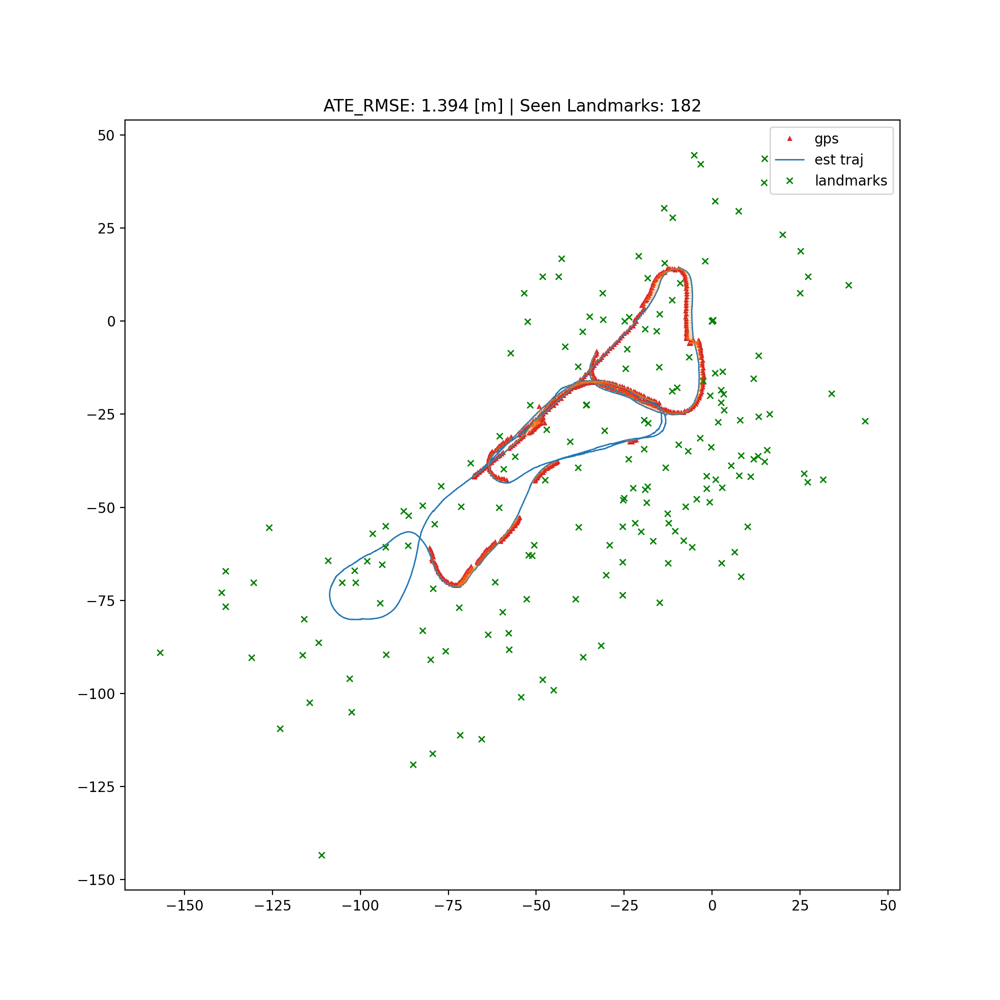

# EKF-SLAM on the Victoria Park Dataset

This repository contains the final project for a SLAM course, focused on solving **EKF-SLAM** using the **Victoria Park Dataset**. The project investigates two scenarios:

1. **Static Landmarks** – Landmarks do not move.
2. **Dynamic Landmarks** – Landmarks move with a constant velocity of **0.05** units in both **X** and **Y** directions.

## Optimization Approach

To fine-tune the performance of the EKF-SLAM implementation, we used **Bayesian Optimization** to optimize the process noise covariance (**Q**) and measurement noise covariance (**R**) matrices.

---

## 📌 Results

### Static Landmarks

- **Best Q:** `[0.0304, 0.0918, 0.0211]`
- **Best R:** `[0.6388, 0.0458]`
- **ATE RMSE:** `1.394`
- **Seen Landmarks:** `182`

#### Generated Map (Static Case)

---

### Dynamic Landmarks

- **Best Q:** `[0.0921, 0.0483, 0.0304]`
- **Best R:** `[0.6852, 0.1107]`
- **ATE RMSE:** `1.773`
- **Seen Landmarks:** `155`

#### Generated Map (Dynamic Case)

---

## 🔍 Parameter Distribution

We also visualized the parameter search space explored by Bayesian Optimization to understand the distribution and sensitivity of the tuning process.

### Static Dataset

### Dynamic Dataset

---

## 📁 Project Structure

