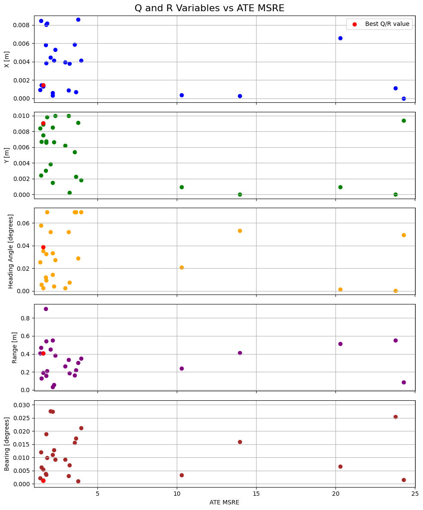
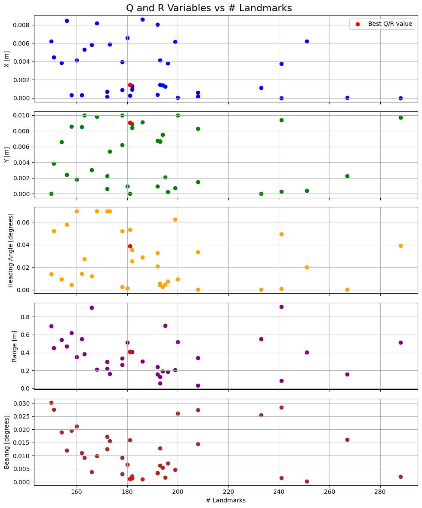
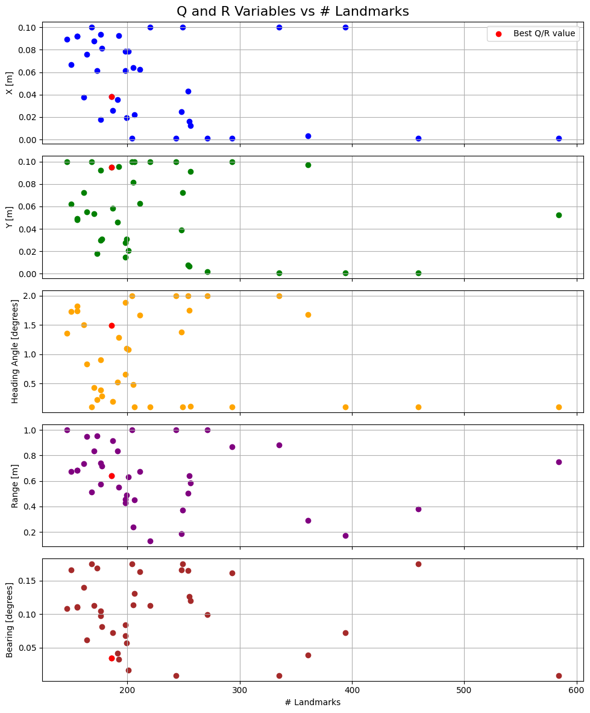

# EKF-SLAM on the Victoria Park Dataset

This repository contains the final project for a SLAM course, focused on solving **EKF-SLAM** using the **Victoria Park Dataset**. The project investigates two scenarios:

1. **Static Landmarks** – Landmarks do not move.
2. **Dynamic Landmarks** – Landmarks move with a constant velocity of **0.05** units in both **X** and **Y** directions.

## Optimization Approach

To fine-tune the performance of the EKF-SLAM implementation, we used **Bayesian Optimization** to optimize the process noise covariance (**Q**) and measurement noise covariance (**R**) matrices.

---

## 📌 Results

### Static Landmarks

- **Best Q:** `[0.0304, 0.0918, 0.0211]`
- **Best R:** `[0.6388, 0.0458]`
- **ATE RMSE:** `1.394`
- **Seen Landmarks:** `182`

#### Generated Map (Static Case)

---

### Dynamic Landmarks

- **Best Q:** `[0.0921, 0.0483, 0.0304]`
- **Best R:** `[0.6852, 0.1107]`
- **ATE RMSE:** `1.773`
- **Seen Landmarks:** `155`

#### Generated Map (Dynamic Case)

---

## 🔍 Parameter Distribution

We also visualized the parameter search space explored by Bayesian Optimization to understand the distribution and sensitivity of the tuning process.

### Static Dataset

<table>
  <tr>
    <td align="center">
      
       <strong>Static Q-R Scatter</strong>
    </td>
    <td align="center">
      
       <strong>Static EKF Map</strong>
    </td>
  </tr>
</table>

### Dynamic Dataset

<table>
  <tr>
    <td align="center">
      
       <strong>Dynamic Q-R Scatter</strong>
    </td>
    <td align="center">
      
       <strong>Dynamic EKF Map</strong>
    </td>
  </tr>
</table>

---

## 📁 Project Structure

.
├── data/ # Victoria Park dataset
├── ekf_slam_dynamic/ # Generated maps while optimization for static
├── ekf_slam_static/ # Generated maps while optimization for dynamic
├── src/ # EKF-SLAM implementation
├── results/ # Output maps, logs, metrics
└── README.md # Project description

## 🛠 Dependencies

- Python 3.11+
- NumPy
- Matplotlib
- [Bayesian Optimization library](https://github.com/SheffieldML/GPyOpt)

---

## 📈 Evaluation Metric

- **ATE RMSE** (Absolute Trajectory Error Root Mean Square Error) is used to evaluate the SLAM accuracy.
- Landmark count indicates how many features were successfully tracked and updated.

---
